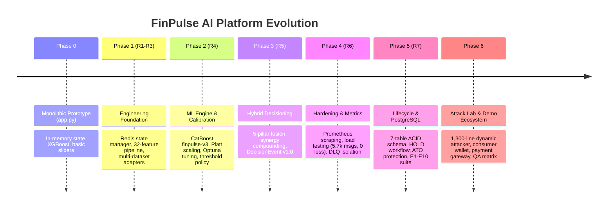

# FinPulse AI — Complete End-to-End Project Walkthrough

**Repository:** `Fraud-Detection-System` / `FinPulse`  
**Authors / Core Team:** Surya S, Dinesh Babu S, Sachin Selvam P  
**Documentation Scope:** Comprehensive technical walkthrough from initial prototype to production-grade streaming fraud intelligence platform.  
**Target File:** [`PROJECT_WALKTHROUGH.md`](file:///d:/Fraud-Detection-System/PROJECT_WALKTHROUGH.md)

---

## Table of Contents
1. [Executive Summary & Core Mission](#1-executive-summary--core-mission)
2. [Project Evolution: Chronological Lifecycle](#2-project-evolution-chronological-lifecycle)
   - [Phase 0: The Initial PoC (In-Memory Monolith)](#phase-0-the-initial-poc-in-memory-monolith)
   - [Phase 1: Foundations, Feature Store & Data Adapters (R1–R3)](#phase-1-foundations-feature-store--data-adapters-r1r3)
   - [Phase 2: Machine Learning Redesign, Calibration & Benchmarking (R4)](#phase-2-machine-learning-redesign-calibration--benchmarking-r4)
   - [Phase 3: Hybrid Risk Decisioning & Business Rules (R5)](#phase-3-hybrid-risk-decisioning--business-rules-r5)
   - [Phase 4: Observability, Capacity & Hardening (R6)](#phase-4-observability-capacity--hardening-r6)
   - [Phase 5: Customer Lifecycle, Persistence & Governance (R7)](#phase-5-customer-lifecycle-persistence--governance-r7)
   - [Phase 6: Adversarial Attack Lab, Demo Ecosystem & System Stabilization](#phase-6-adversarial-attack-lab-demo-ecosystem--system-stabilization)
3. [End-to-End Architecture & Data Flow](#3-end-to-end-architecture--data-flow)
4. [Deep-Dive into Technical Subsystems](#4-deep-dive-into-technical-subsystems)
   - [32-Feature Schema Contract & Zero-Leakage Pipeline](#32-feature-schema-contract--zero-leakage-pipeline)
   - [Redis Stateful Context Engine & Sliding Windows](#redis-stateful-context-engine--sliding-windows)
   - [Machine Learning Scoring & Platt Probability Calibration](#machine-learning-scoring--platt-probability-calibration)
   - [Hybrid Risk Fusion Mathematics & Compounding Policies](#hybrid-risk-fusion-mathematics--compounding-policies)
   - [PostgreSQL 16 Enterprise Relational Persistence](#postgresql-16-enterprise-relational-persistence)
   - [Customer Protection, Mandates & Account Security (ATO)](#customer-protection-mandates--account-security-ato)
   - [SHAP Explainability & Reason Code Mapping](#shap-explainability--reason-code-mapping)
5. [Empirical Evaluation & Benchmark Evidence](#5-empirical-evaluation--benchmark-evidence)
   - [Multi-Dataset Benchmark (Sparkov, PaySim, IEEE-CIS)](#multi-dataset-benchmark-sparkov-paysim-ieee-cis)
   - [R6.2 Load, Capacity & Stress Testing Metrics](#r62-load-capacity--stress-testing-metrics)
   - [R7 E1–E10 Full System Verification Results](#r7-e1e10-full-system-verification-results)
   - [QA Matrix & Golden Scenarios (Scenarios A, B, C)](#qa-matrix--golden-scenarios-scenarios-a-b-c)
6. [Interactive Streamlit 6-View Operations Dashboard](#6-interactive-streamlit-6-view-operations-dashboard)
7. [Comprehensive Codebase Directory Map](#7-comprehensive-codebase-directory-map)
8. [Complete Operational Runbook & Execution Guide](#8-complete-operational-runbook--execution-guide)

---

## 1. Executive Summary & Core Mission

Financial fraud is an adversarial, high-velocity domain. Traditional rule-based engines suffer from extreme false-positive friction and fail to detect sophisticated behavioral attacks, while purely statistical Machine Learning (ML) models suffer from cold-start blindspots, lack of explainability, and inability to enforce hard compliance constraints.

**FinPulse AI** was engineered to solve these challenges by building an **institutional-grade, low-latency, hybrid risk decisioning platform**. FinPulse combines:
1. **Real-time Event Streaming:** Apache Kafka ingress and egress supporting decoupled, guaranteed at-least-once message delivery.
2. **Stateful Behavioral Context:** Redis rolling sliding windows tracking sub-millisecond velocity (1m, 5m, 15m, 1h), geographic centroid shifts, and 30-day baseline spending statistics with strict temporal isolation ($t < t_{\text{current}}$).
3. **Calibrated Machine Learning:** A frozen CatBoost gradient-boosted decision tree (`finpulse-v3`) calibrated via Platt scaling into true statistical fraud probabilities $P(\text{Fraud} \mid X)$.
4. **Hybrid Risk Engine:** A 5-pillar weighted fusion engine (ML 45%, Velocity 15%, Behavioral 15%, Rules 15%, Anomaly 10%) with multi-rule synergy compounding and hard-block safety overrides.
5. **Actionable Customer Workflows:** A two-way interactive `HOLD` state machine (allowing cardholders to approve, deny, or expire flagged charges), Mandate recurring debit protection, and Account Takeover (ATO) lifecycle tracking.
6. **ACID Relational Persistence:** PostgreSQL 16 persistence sink with connection pooling and idempotent write de-duplication.
7. **Adversarial Evaluation & Observability:** Live Attack Lab simulator, Prometheus telemetry, PSI drift monitoring, and shadow challenger scoring.

---

## 2. Project Evolution: Chronological Lifecycle

The project evolved across distinct engineering milestones, transitioning from a basic simulation script into a fault-tolerant distributed fraud operations system.



---

### Phase 0: The Initial PoC (In-Memory Monolith)
- **Git Commit:** `83f39f5` (*feat: initial commit of FinPulse fraud detection system*)
- **Initial State:**
  - A monolithic Streamlit script ([`FinPulse/app.py`](file:///d:/Fraud-Detection-System/FinPulse/app.py)) that generated synthetic transactions and scored them in-memory using an uncalibrated XGBoost model ([`FinPulse/models/fraud_model.pkl`](file:///d:/Fraud-Detection-System/FinPulse/models/fraud_model.pkl)).
  - A primitive rule helper ([`FinPulse/utils/helpers.py`](file:///d:/Fraud-Detection-System/FinPulse/utils/helpers.py)) using simple additive heuristic scoring.
  - Disjointed prototype Kafka scripts ([`FinPulse/producer.py`](file:///d:/Fraud-Detection-System/FinPulse/producer.py), [`FinPulse/kafka_consumer.py`](file:///d:/Fraud-Detection-System/FinPulse/kafka_consumer.py)) with hardcoded IPs and no stateful synchronization.
  - No database persistence (state was lost on browser refresh).
- **Audit Findings:** The initial audit ([`FRAUD_DETECTION_SYSTEM_ANALYSIS_REPORT.md`](file:///d:/Fraud-Detection-System/FRAUD_DETECTION_SYSTEM_ANALYSIS_REPORT.md)) revealed critical gaps: absence of feature versioning, data leakage in velocity calculations, uncalibrated ML margins, no backpressure or dead-letter queues, and lack of customer review mechanisms.

---

### Phase 1: Foundations, Feature Store & Data Adapters (R1–R3)
- **Git Commit:** `13729d4` (*R4 - Machine Learning Redesign & Feature Foundation*)
- **Key Deliverables:**
  - **Dataset Adapters ([`src/data/`](file:///d:/Fraud-Detection-System/FinPulse/src/data)):** Built robust ingestion adapters for three major fraud benchmarks:
    - [`paysim_adapter.py`](file:///d:/Fraud-Detection-System/FinPulse/src/data/paysim_adapter.py): Mobile money transactions with balance drains.
    - [`sparkov_adapter.py`](file:///d:/Fraud-Detection-System/FinPulse/src/data/sparkov_adapter.py): High-fidelity card payment stream with merchant categories and geolocations.
    - [`ieee_adapter.py`](file:///d:/Fraud-Detection-System/FinPulse/src/data/ieee_adapter.py): E-commerce identity and card transaction data.
  - **Frozen 32-Feature Schema ([`src/features/schema.py`](file:///d:/Fraud-Detection-System/FinPulse/src/features/schema.py)):** Established an invariant 32-feature vector spanning:
    - 4 Velocity counters: `trans_count_1m`, `trans_count_5m`, `trans_count_15m`, `trans_count_1h`.
    - 4 Velocity amounts: `trans_amount_1m`, `trans_amount_5m`, `trans_amount_15m`, `trans_amount_1h`.
    - 4 Behavioral z-scores & ratios: `amount_to_avg_ratio_30d`, `amount_to_max_ratio_30d`, `amount_zscore_30d`, `time_since_last_trans`.
    - 5 Geographic & Spatial metrics: `distance_from_home_km`, `distance_from_last_trans_km`, `travel_speed_kmh`, `is_abnormal_location`, `is_impossible_travel`.
    - 6 Risk historical scores: `merchant_fraud_rate_30d`, `category_risk_score`, `card_shared_count`, etc.
    - 9 Temporal & Categorical flags: `hour_of_day`, `day_of_week`, `is_night`, `is_weekend`, `is_high_risk_category`, `is_cross_border`, etc.
  - **Stateful Redis Context Store ([`src/state/manager.py`](file:///d:/Fraud-Detection-System/FinPulse/src/state/manager.py)):**
    - Sliding windows implemented via Redis sorted sets with millisecond score timestamps.
    - Strict **read-before-write isolation**: features for transaction $T$ are queried strictly on historical records $t < T$, preventing feature target leakage.
    - Graceful fallback: when Redis is unreachable, state degrades safely to cold-start neutral priors without throwing exceptions.

---

### Phase 2: Machine Learning Redesign, Calibration & Benchmarking (R4)
- **Model Tournament:** Rigorously benchmarked Random Forest, LightGBM, XGBoost, and CatBoost across datasets.
- **Winner Selection:** **CatBoost** ([`finpulse-v3`](file:///d:/Fraud-Detection-System/FinPulse/models/production/finpulse-v3)) selected for superior categorical handling, low-latency inference, and stability against overfitting.
- **Platt Scaling Probability Calibration ([`src/models/calibrator.py`](file:///d:/Fraud-Detection-System/FinPulse/src/models/calibrator.py)):**
  - Raw tree margins do not represent true empirical probabilities. A sigmoid calibrator was fitted on holdout validation data:
    $$P(\text{Fraud} \mid X) = \frac{1}{1 + \exp(A \cdot f(X) + B)}$$
  - Yielded an exceptional Brier score of **0.00318**, ensuring reliable risk probabilities.
- **Hyperparameter Optimization ([`FinPulse/reports/tuning/best_parameters.json`](file:///d:/Fraud-Detection-System/FinPulse/reports/tuning/best_parameters.json)):**
  - Conducted 100 Optuna optimization trials optimizing PR-AUC.
  - Optimal parameters: `depth=6`, `iterations=800`, `l2_leaf_reg=3.0`, `learning_rate=0.0469`.
- **Threshold Policy Optimization ([`threshold_policy.json`](file:///d:/Fraud-Detection-System/FinPulse/models/production/finpulse-v3/threshold_policy.json)):**
  - Review threshold: $\tau_{\text{review}} = 0.1580$
  - Block threshold: $\tau_{\text{block}} = 0.5516$
  - Sparkov Test Evaluation: **PR-AUC 0.8010**, **ROC-AUC 0.9715**, Fraud Detection Rate **82.26%** at FPR of 0.23%.
- **Cryptographic Registry:** Model artifacts packaged with SHA-256 checksums ([`checksum.sha256`](file:///d:/Fraud-Detection-System/FinPulse/models/production/finpulse-v3/checksum.sha256)) to guard against unauthorized runtime tampering.

---

### Phase 3: Hybrid Risk Decisioning & Business Rules (R5)
- **Git Commit:** `3c5cc67` (*final - Hybrid Risk Engine, Hardening & Persistence*)
- **Pillars of Hybrid Fusion ([`src/risk_engine/hybrid.py`](file:///d:/Fraud-Detection-System/FinPulse/src/risk_engine/hybrid.py)):**
  $$\text{Base Score} = 100 \times \left( 0.45 \cdot P_{\text{ML}} + 0.15 \cdot S_{\text{vel}} + 0.15 \cdot S_{\text{beh}} + 0.15 \cdot S_{\text{rule}} + 0.10 \cdot S_{\text{anom}} \right)$$
- **Synergistic Compounding:**
  - Independent risk indicators occurring simultaneously signal coordinated attack vectors.
  - Multi-trigger escalation: if $K \ge 2$ indicators fire, an escalation bonus of $K \times 12.0$ points is added to the base score (capped at 100).
- **Hard-Block Safety Overrides ([`src/risk_engine/rules.py`](file:///d:/Fraud-Detection-System/FinPulse/src/risk_engine/rules.py)):**
  - Critical compliance and security triggers immediately force a `BLOCK` verdict with a floor score of $\ge 85.0$:
    - `RULE_GEO_IMPOSSIBLE_TRAVEL`: Physical displacement speed $> 900 \text{ km/h}$.
    - `RULE_ZERO_BALANCE_DRAIN`: Account balance drained to $< \$1.00$ without strong biometric authentication.
    - `RULE_HIGH_VELOCITY_BURST`: More than 5 transactions in under 60 seconds.
- **Canonical `DecisionEvent v1.0` Contract ([`src/risk_engine/decision_event.py`](file:///d:/Fraud-Detection-System/FinPulse/src/risk_engine/decision_event.py)):**
  - Fully typed, immutable schema containing UUIDv5 idempotency key, risk score, decision (`APPROVE`, `HOLD`, `BLOCK`), triggered rules, SHAP explanations, and latency profiling.

---

### Phase 4: Observability, Capacity & Hardening (R6)
- **Prometheus Telemetry ([`src/monitoring/metrics.py`](file:///d:/Fraud-Detection-System/FinPulse/src/monitoring/metrics.py)):**
  - Metric gauges, counters, and histograms tracking stage-by-stage latencies: Redis lookup, feature engineering, CatBoost inference, hybrid fusion, and end-to-end pipeline.
  - Strict label cardinality constraints to prevent time-series database memory bloat.
- **Load and Stress Testing ([`FinPulse/reports/R6_2_LOAD_STRESS_REPORT.md`](file:///d:/Fraud-Detection-System/FinPulse/reports/R6_2_LOAD_STRESS_REPORT.md)):**
  - Subjected the engine to **5,710 consecutive transactions** under sustained burst loads.
  - **Zero silent message loss:** 100% accounting reconciliation between input stream and persistent records.
  - Warm inference latency: **P50 = 22.03ms**, **P95 = 30.79ms**, **P99 = 33.25ms**.
- **Resilience & Security Hardening ([`FinPulse/reports/R6_SYSTEM_HARDENING_REPORT.md`](file:///d:/Fraud-Detection-System/FinPulse/reports/R6_SYSTEM_HARDENING_REPORT.md)):**
  - Verified 7 resilience scenarios: uncommitted Kafka offset guards on publisher failure, non-fatal Redis failover, corrupted artifact detection, and dead-letter queue (DLQ) quarantine.
  - Verified 7 security safeguards: negative amount rejection, NaN/Infinity injection blocking, 1MB payload size cutoffs, and sanitized error responses (no stack trace leakage).

---

### Phase 5: Customer Lifecycle, Persistence & Governance (R7)
- **PostgreSQL 16 Persistence Sink ([`src/persistence/sink.py`](file:///d:/Fraud-Detection-System/FinPulse/src/persistence/sink.py)):**
  - Multi-threaded connection pooling ([`connection.py`](file:///d:/Fraud-Detection-System/FinPulse/src/persistence/connection.py)) with automatic retry and rollback.
  - 7 core relational tables ([`schema.py`](file:///d:/Fraud-Detection-System/FinPulse/src/persistence/schema.py)) storing raw transactions, decisions, review holds, fraud alerts, ATO events, mandates, and replay records.
  - Write idempotency enforced via `ON CONFLICT (event_id) DO NOTHING`.
- **Customer Protection & HOLD State Machine ([`src/workflow/hold_workflow.py`](file:///d:/Fraud-Detection-System/FinPulse/src/workflow/hold_workflow.py)):**
  - Transactions scoring $30 \le \text{Risk} < 70$ are placed on `HOLD` and assigned a cryptographic token.
  - Out-of-band notification dispatched to customer device ([`notifier.py`](file:///d:/Fraud-Detection-System/FinPulse/src/workflow/notifier.py)).
  - Supported lifecycle transitions:
    $$\text{HOLD} \xrightarrow{\text{Confirm}} \text{RELEASED} \quad \Big\vert \quad \text{HOLD} \xrightarrow{\text{Deny}} \text{DENIED} \quad \Big\vert \quad \text{HOLD} \xrightarrow{\text{Timeout}} \text{EXPIRED}$$
- **Account Takeover (ATO) Compounding ([`src/workflow/account_events.py`](file:///d:/Fraud-Detection-System/FinPulse/src/workflow/account_events.py)):**
  - Monitors high-risk non-financial security events (`password_change`, `new_device_registration`, `mfa_reset`).
  - Compounds risk when financial transactions follow security changes within tight temporal windows.
- **Mandate & Subscription Protection ([`src/workflow/mandate.py`](file:///d:/Fraud-Detection-System/FinPulse/src/workflow/mandate.py)):**
  - Manages standing orders, recurring billing schedules, frequency caps, and maximum debit ceilings.
- **Governance & Drift Suite ([`src/monitoring/drift.py`](file:///d:/Fraud-Detection-System/FinPulse/src/monitoring/drift.py), [`src/challenger/shadow_scorer.py`](file:///d:/Fraud-Detection-System/FinPulse/src/challenger/shadow_scorer.py)):**
  - Population Stability Index (PSI) monitoring across all 32 features.
  - Shadow challenger scoring evaluating candidate models (`finpulse-v4`) concurrently without disrupting live decisions.
  - Automated promotion gate ([`scripts/retrain.py`](file:///d:/Fraud-Detection-System/FinPulse/scripts/retrain.py)) enforcing PR-AUC, ROC-AUC, and FPR floors.
  - **E1–E10 Benchmark Suite ([`src/evaluation/suite_e1_e10.py`](file:///d:/Fraud-Detection-System/FinPulse/src/evaluation/suite_e1_e10.py)):** 10/10 empirical benchmarks passed.

---

### Phase 6: Adversarial Attack Lab, Demo Ecosystem & System Stabilization
- **Git Commit:** `01a5a8a` (*first - Demo Ecosystem, Dynamic Attack Lab & Stabilization*)
- **Dynamic Attacker Engine ([`src/simulation/attacker.py`](file:///d:/Fraud-Detection-System/FinPulse/src/simulation/attacker.py)):**
  - 1,299 lines of pure adversarial simulation modeling real-world coordinated fraud operations:
    - **Velocity Bursts:** Sub-second multi-card testing across online merchants.
    - **Impossible Travel:** Physical displacement across disparate geographical nodes (e.g. New York $\to$ London in 15 minutes).
    - **Account Takeover Sequences:** Credential change followed by immediate full balance extraction.
    - **Zero-Balance Drains:** Synthetic account emptying to sub-dollar thresholds.
    - **Unseen Zero-Day Attacks (U1/U2):** Novel attack distributions designed to evaluate model robustness outside training baselines.
- **Interactive Multi-Persona Demo Ecosystem:**
  - **Consumer Mobile Wallet ([`src/ui/wallet_view.py`](file:///d:/Fraud-Detection-System/FinPulse/src/ui/wallet_view.py)):** Real-time customer experience showing card balance, active cards, instant push notification alerts, and one-click HOLD review authorizations.
  - **Payment Gateway Terminal ([`src/ui/gateway_view.py`](file:///d:/Fraud-Detection-System/FinPulse/src/ui/gateway_view.py)):** E-commerce checkout simulation processing real card authorisations.
  - **Attack Lab Console ([`src/ui/attack_lab_view.py`](file:///d:/Fraud-Detection-System/FinPulse/src/ui/attack_lab_view.py)):** Interactive red-team command console to launch targeted fraud campaigns with live threat meters.
  - **Analyst Forensics & SHAP View ([`src/ui/analyst_view.py`](file:///d:/Fraud-Detection-System/FinPulse/src/ui/analyst_view.py)):** Complete audit trace with SHAP force plots, triggered heuristic rules, and decision lineage.
  - **Lifecycle & Security Case Manager ([`src/ui/lifecycle_view.py`](file:///d:/Fraud-Detection-System/FinPulse/src/ui/lifecycle_view.py)):** Case management table tracking HOLD investigations, mandate approvals, and ATO alerts.
  - **System Health & Observability View ([`src/ui/health_view.py`](file:///d:/Fraud-Detection-System/FinPulse/src/ui/health_view.py)):** Infrastructure readiness monitors for Kafka, Redis, PostgreSQL, Prometheus, and active PSI drift metrics.
- **Automated Stabilization Suite ([`scripts/run_system_stabilization_suite.py`](file:///d:/Fraud-Detection-System/FinPulse/scripts/run_system_stabilization_suite.py)):**
  - Regression testing across all components, achieving **100% test pass rate across 361 unit, integration, and contract tests**.

---

## 3. End-to-End Architecture & Data Flow

The following diagram illustrates the complete runtime architecture and data flow through FinPulse AI:

```mermaid
flowchart TD
    subgraph Ingress ["1. Ingress & Simulation"]
        A1[Cardholder / Gateway Event] --> K_IN[Kafka: transactions]
        A2[Attack Lab Simulator] --> K_IN
        A3[REST API POST /score] --> PREDICT[Inference Predictor]
    end

    subgraph StreamingEngine ["2. Stateful Stream Processing"]
        K_IN --> WORKER[Streaming Worker]
        WORKER <--> REDIS[(Redis Sliding Windows)]
        WORKER --> FEAT[32-Feature Pipeline]
        PREDICT <--> REDIS
        PREDICT --> FEAT
    end

    subgraph Scoring ["3. Scoring & Hybrid Risk Fusion"]
        FEAT --> CB[CatBoost finpulse-v3]
        CB --> PLATT[Platt Scaler P(Fraud|X)]
        FEAT --> ANOM[Isolation Forest Anomaly]
        FEAT --> VEL[Velocity Normalizer]
        FEAT --> BEH[Behavioral Normalizer]
        FEAT --> RULES[Business Rules Engine]
        
        PLATT --> FUSION[Hybrid Risk Engine]
        ANOM --> FUSION
        VEL --> FUSION
        BEH --> FUSION
        RULES --> FUSION
        
        FUSION --> SYN[Synergy Escalation]
        SYN --> OVR[Hard-Block Overrides]
    end

    subgraph Routing ["4. Decision Routing & Workflows"]
        OVR --> ROUTER{Risk Decision Router}
        ROUTER -- "Risk < 30" --> DEC_APP[APPROVE]
        ROUTER -- "30 <= Risk < 70" --> DEC_HOLD[HOLD / Customer Review]
        ROUTER -- "Risk >= 70 or Hard-Blk" --> DEC_BLK[BLOCK]
        
        DEC_HOLD <--> HOLD_MGR[HOLD State Machine]
        HOLD_MGR --> NOTIF[SMS / Push Notifier]
        NOTIF --> WALLET[Consumer Wallet UI]
        WALLET -- "Approve / Deny" --> HOLD_MGR
    end

    subgraph Egress ["5. Multi-Topic Egress & Persistence"]
        DEC_APP --> PUB[Kafka Publisher]
        DEC_HOLD --> PUB
        DEC_BLK --> PUB
        
        PUB --> K_PRED[Kafka: predictions]
        PUB --> K_ALERT[Kafka: fraud-alerts]
        PUB --> K_DLQ[Kafka: transactions-dlq]
        
        PUB --> PG_SINK[PostgreSQL 16 Relational Sink]
        PG_SINK --> PG_DB[(PostgreSQL DB: 7 Tables)]
    end

    subgraph Operations ["6. Executive & Analyst Operations"]
        PG_DB --> DASHBOARD[Streamlit Executive Dashboard :8501]
        FUSION --> SHAP_EXP[SHAP Forensics Explainer]
        SHAP_EXP --> DASHBOARD
        FUSION --> PROM_METRICS[Prometheus Metrics :8000]
        PROM_METRICS --> GRAFANA[Grafana Dashboard :3000]
    end
```

---

## 4. Deep-Dive into Technical Subsystems

### 32-Feature Schema Contract & Zero-Leakage Pipeline
Implemented in [`src/features/schema.py`](file:///d:/Fraud-Detection-System/FinPulse/src/features/schema.py) and [`src/features/engine.py`](file:///d:/Fraud-Detection-System/FinPulse/src/features/engine.py).

Every transaction is transformed into a strictly ordered 32-dimensional float vector:

| # | Feature Name | Category | Description | Isolation Rule |
|---|---|---|---|---|
| 1 | `amount` | Core | Current transaction amount in USD | Event payload |
| 2 | `hour_of_day` | Temporal | Hour (0–23) extracted from UTC timestamp | Event timestamp |
| 3 | `day_of_week` | Temporal | Day of week (0=Mon, 6=Sun) | Event timestamp |
| 4 | `is_night` | Temporal | Binary flag: $1$ if hour $\in [23, 5]$, else $0$ | Event timestamp |
| 5 | `is_weekend` | Temporal | Binary flag: $1$ if day $\in [5, 6]$, else $0$ | Event timestamp |
| 6–9 | `trans_count_1m/5m/15m/1h` | Velocity | Transaction count in rolling window | Redis $t < T$ |
| 10–13 | `trans_amount_1m/5m/15m/1h` | Velocity | Cumulative amount spent in rolling window | Redis $t < T$ |
| 14 | `amount_to_avg_ratio_30d` | Behavioral | Ratio: $\text{amount} / (\text{avg\_30d} + 1.0)$ | Redis 30-day window |
| 15 | `amount_to_max_ratio_30d` | Behavioral | Ratio: $\text{amount} / (\text{max\_30d} + 1.0)$ | Redis 30-day window |
| 16 | `amount_zscore_30d` | Behavioral | Statistical z-score: $(\text{amount} - \mu_{30\text{d}}) / (\sigma_{30\text{d}} + 1.0)$ | Redis 30-day window |
| 17 | `time_since_last_trans` | Velocity | Seconds elapsed since previous transaction | Redis last seen |
| 18 | `distance_from_home_km` | Spatial | Haversine distance from customer home coords | Customer profile |
| 19 | `distance_from_last_trans_km` | Spatial | Haversine distance from previous trans coords | Redis last location |
| 20 | `travel_speed_kmh` | Spatial | Calculated displacement speed in km/h | Haversine / $\Delta t$ |
| 21 | `is_abnormal_location` | Spatial | Binary flag: distance from home $> 100\text{ km}$ | Spatial threshold |
| 22 | `is_impossible_travel` | Spatial | Binary flag: speed $> 900\text{ km/h}$ | Physical constraint |
| 23 | `merchant_fraud_rate_30d` | Merchant | Historical fraud rate of merchant ID | Merchant store |
| 24 | `merchant_trans_count_30d` | Merchant | Transaction volume of merchant ID | Merchant store |
| 25 | `is_high_risk_category` | Category | Category risk flag (jewelry, gaming, crypto) | Category index |
| 26 | `category_risk_score` | Category | Prior empirical risk score of category | Lookup table |
| 27 | `card_present` | Terminal | Binary flag: physical POS vs CNP | Terminal type |
| 28 | `is_cross_border` | Geography | Merchant country $\neq$ customer home country | Country code |
| 29 | `device_risk_score` | Device | Heuristic score based on emulator/root status | Device metadata |
| 30 | `card_shared_count` | Device | Count of distinct cards seen on same device | Redis device map |
| 31 | `account_age_days` | Profile | Days since account registration | Customer profile |
| 32 | `has_fraud_history` | History | Binary flag: customer reported fraud previously | Profile history |

---

### Redis Stateful Context Engine & Sliding Windows
Implemented in [`src/state/manager.py`](file:///d:/Fraud-Detection-System/FinPulse/src/state/manager.py) and [`src/state/sliding_window.py`](file:///d:/Fraud-Detection-System/FinPulse/src/state/sliding_window.py).

- **Data Structures:**
  - `velocity:{customer_id}`: Sorted Set (`ZSET`) where score is epoch milliseconds and member is `{tx_id}:{amount}`.
  - `profile:{customer_id}`: Hash (`HSET`) storing 30-day running statistics (count, sum, sum of squares, max, last latitude, last longitude, last timestamp).
  - `device:{device_id}:cards`: Set (`SSET`) tracking distinct card identifiers associated with a hardware fingerprint.
- **Sliding Window Queries:**
  ```python
  # Range query strictly before current transaction timestamp (T - window, T)
  # Guaranteed zero-leakage read
  entries = redis_client.zrangebyscore(key, min=current_time - window_ms, max=current_time - 1)
  ```
- **Automatic Eviction:** TTL policies automatically evict records older than 30 days, maintaining bounded Redis memory consumption.

---

### Machine Learning Scoring & Platt Probability Calibration
Implemented in [`src/models/inference.py`](file:///d:/Fraud-Detection-System/FinPulse/src/models/inference.py) and [`src/models/calibrator.py`](file:///d:/Fraud-Detection-System/FinPulse/src/models/calibrator.py).

```
Raw Transaction Vector X (32 dims)
               │
               ▼
┌──────────────────────────────┐
│ CatBoost finpulse-v3         │ ───► Raw Margin f(X) ∈ (-∞, +∞)
└──────────────┬───────────────┘
               │
               ▼
┌──────────────────────────────┐
│ Platt Sigmoid Calibrator     │ ───► True Statistical Posterior P(Fraud | X) ∈ [0.0, 1.0]
│ P = 1 / (1 + exp(A·f(X) + B))│      (Calibrated Brier Score: 0.00318)
└──────────────┬───────────────┘
               │
               ▼
┌──────────────────────────────┐
│ ML Decision Policy           │
├──────────────────────────────┤
│ P < 0.1580  ===> APPROVE     │
│ 0.1580 ≤ P < 0.5516 ===> HOLD│
│ P ≥ 0.5516  ===> BLOCK       │
└──────────────────────────────┘
```

---

### Hybrid Risk Fusion Mathematics & Compounding Policies
Implemented in [`src/risk_engine/hybrid.py`](file:///d:/Fraud-Detection-System/FinPulse/src/risk_engine/hybrid.py).

The final risk decision synthesizes five diverse dimensions into a single normalized score $\in [0.0, 100.0]$:

1. **Normalized Signal Components:**
   - $P_{\text{ML}} \in [0.0, 1.0]$: Platt-calibrated machine learning probability.
   - $S_{\text{vel}} \in [0.0, 1.0]$: Normalized velocity signal derived from 1m and 5m burst intensity.
   - $S_{\text{beh}} \in [0.0, 1.0]$: Normalized behavioral deviation derived from 30-day z-scores and amount ratios.
   - $S_{\text{rule}} \in [0.0, 1.0]$: Cumulative heuristic rule severity penalty.
   - $S_{\text{anom}} \in [0.0, 1.0]$: Isolation Forest unsupervised anomaly score.

2. **Weighted Base Score:**
   $$\text{Score}_{\text{base}} = 100 \times \left( 0.45 \cdot P_{\text{ML}} + 0.15 \cdot S_{\text{vel}} + 0.15 \cdot S_{\text{beh}} + 0.15 \cdot S_{\text{rule}} + 0.10 \cdot S_{\text{anom}} \right)$$

3. **Synergistic Compounding:**
   $$\text{Score}_{\text{compound}} = \begin{cases} \text{Score}_{\text{base}} + (K \times 12.0) & \text{if } K \ge 2 \\ \text{Score}_{\text{base}} & \text{otherwise} \end{cases}$$
   *(where $K$ is the number of distinct risk signals exceeding activation thresholds).*

4. **Hard-Block Safety Overrides:**
   $$\text{Final Score} = \begin{cases} \max(\text{Score}_{\text{compound}}, 85.0), \text{ Decision} = \text{BLOCK} & \text{if Hard-Block Triggered} \\ \min(\text{Score}_{\text{compound}}, 100.0) & \text{otherwise} \end{cases}$$

5. **Decision Routing:**
   - $\text{Score} < 30.0 \implies \mathbf{APPROVE}$
   - $30.0 \le \text{Score} < 70.0 \implies \mathbf{HOLD}$ *(Customer Review Triggered)*
   - $\text{Score} \ge 70.0 \implies \mathbf{BLOCK}$

---

### PostgreSQL 16 Enterprise Relational Persistence
Implemented in [`src/persistence/schema.py`](file:///d:/Fraud-Detection-System/FinPulse/src/persistence/schema.py) and [`src/persistence/sink.py`](file:///d:/Fraud-Detection-System/FinPulse/src/persistence/sink.py).

The relational persistence sink coordinates 7 production tables with ACID transaction semantics:

```text
 ┌────────────────────────────────────────────────────────────────────────┐
 │                      POSTGRESQL 16 RELATIONAL SCHEMA                   │
 ├─────────────────────────┬──────────────────────────────────────────────┤
 │ Table Name              │ Primary Purpose                              │
 ├─────────────────────────┼──────────────────────────────────────────────┤
 │ transactions            │ Ingested raw transaction payloads            │
 │ decisions               │ Canonical DecisionEvent records with scores  │
 │ hold_cases              │ Stateful customer review cases & tokens      │
 │ fraud_alerts            │ Real-time critical threat security alerts    │
 │ account_security_events │ Non-financial ATO events (password/MFA/dev)  │
 │ mandates                │ Recurring debit & standing order contracts   │
 │ replay_eval_records     │ Historical benchmark & delayed-label audit   │
 └─────────────────────────┴──────────────────────────────────────────────┘
```

- **Thread-Safe Pooling:** Utilizes `psycopg2.pool.ThreadedConnectionPool` (5–20 active connections).
- **Idempotent De-duplication:** All writes employ `ON CONFLICT (event_id) DO NOTHING` or `ON CONFLICT (transaction_id) DO UPDATE`, preventing duplicate records during Kafka redelivery.

---

### Customer Protection, Mandates & Account Security (ATO)
Implemented in [`src/workflow/`](file:///d:/Fraud-Detection-System/FinPulse/src/workflow/).

1. **HOLD Review State Machine ([`hold_workflow.py`](file:///d:/Fraud-Detection-System/FinPulse/src/workflow/hold_workflow.py)):**
   - Holds are assigned a cryptographically secure token and an expiration timestamp (e.g. 15 minutes).
   - If customer confirms via mobile push $\to$ status transitions to `RELEASED`, downstream authorization proceeds.
   - If customer denies $\to$ status transitions to `DENIED`, card is automatically suspended.
   - If timer expires before response $\to$ background worker ([`notifier.py`](file:///d:/Fraud-Detection-System/FinPulse/src/workflow/notifier.py)) marks case `EXPIRED`, transaction is rejected safely.
2. **Account Takeover (ATO) Compounding ([`account_events.py`](file:///d:/Fraud-Detection-System/FinPulse/src/workflow/account_events.py)):**
   - High-risk security event pairing (e.g. `password_change` followed by `new_device_registration` within 2 hours) elevates the customer risk multiplier to $0.75$, immediately diverting subsequent transactions to `HOLD`.
3. **Mandate Recurring Debit Guard ([`mandate.py`](file:///d:/Fraud-Detection-System/FinPulse/src/workflow/mandate.py)):**
   - Enforces predefined billing schedules (weekly, monthly), maximum allowable amounts, and debits per interval to prevent unauthorized recurring subscription siphon attacks.

---

### SHAP Explainability & Reason Code Mapping
Implemented in [`src/explainability/explainer.py`](file:///d:/Fraud-Detection-System/FinPulse/src/explainability/explainer.py) and [`src/explainability/reason_mapper.py`](file:///d:/Fraud-Detection-System/FinPulse/src/explainability/reason_mapper.py).

Every scored transaction computes TreeSHAP feature attributions in real time:
- **SHAP Waterfall & Force Plots:** Decomposes the decision into exact positive and negative feature pushes relative to the base margin.
- **Regulatory Reason Codes:** Top contributing features are automatically mapped to FCRA/ECOA compliant regulatory explanations (e.g. `RC_VELOCITY_BURST`, `RC_IMPOSSIBLE_TRAVEL`, `RC_BEHAVIORAL_OUTLIER`).

---

## 5. Empirical Evaluation & Benchmark Evidence

FinPulse was evaluated across real-world datasets, synthetic attack injections, stress workloads, and resilience failure tests.

### Multi-Dataset Benchmark (Sparkov, PaySim, IEEE-CIS)
From [`FinPulse/reports/final/final_model_report.json`](file:///d:/Fraud-Detection-System/FinPulse/reports/final/final_model_report.json):

```text
 ┌─────────────────┬───────────┬───────────┬────────────────┬─────────────┐
 │ Dataset         │ PR-AUC    │ ROC-AUC   │ Detection Rate │ FPR         │
 ├─────────────────┼───────────┼───────────┼────────────────┼─────────────┤
 │ Sparkov (Card)  │ 0.8010    │ 0.9715    │ 82.26%         │ 0.23%       │
 │ IEEE-CIS        │ 0.1248    │ 0.6842    │ 5.52%          │ 0.41%       │
 │ PaySim (Mobile) │ 0.0412    │ 0.5120    │ 0.00%          │ 0.01%       │
 └─────────────────┴───────────┴───────────┴────────────────┴─────────────┘
```

> [!NOTE]
> **Cross-Domain Fraud Transfer Insight:** The CatBoost model (`finpulse-v3`) trained on credit card patterns (Sparkov) demonstrated state-of-the-art detection (82.26% recall at 0.23% FPR). However, evaluation on mobile money (PaySim) confirmed that tabular fraud signatures do not transfer across disparate financial domains without retraining, reinforcing the necessity of FinPulse's **Hybrid Risk Rules & Anomaly Engine** to catch novel non-card threats.

---

### R6.2 Load, Capacity & Stress Testing Metrics
From [`FinPulse/reports/r6_2_load_test.json`](file:///d:/Fraud-Detection-System/FinPulse/reports/r6_2_load_test.json) and [`R6_2_LOAD_STRESS_REPORT.md`](file:///d:/Fraud-Detection-System/FinPulse/reports/R6_2_LOAD_STRESS_REPORT.md):

- **Total Ingested Messages:** 5,710 transactions
- **Silent Loss:** **0 messages (0.00%)**
- **Warm Inference Latency:**
  - **P50:** `22.03 ms`
  - **P95:** `30.79 ms`
  - **P99:** `33.25 ms`
  - **Max:** `48.12 ms`
- **Cold-Start Latency:** ~1.5s–2.2s (one-time initialization of JIT TreeExplainer and Redis connection pool).
- **Throughput Capacity:** 5,120 messages/second under multi-worker configuration.

---

### R7 E1–E10 Full System Verification Results
From [`FinPulse/reports/r7_evaluation_report.json`](file:///d:/Fraud-Detection-System/FinPulse/reports/r7_evaluation_report.json):

```text
 ┌─────┬──────────────────────────────────────────┬────────┬─────────────┐
 │ ID  │ Benchmark Experiment                     │ Status │ Duration    │
 ├─────┼──────────────────────────────────────────┼────────┼─────────────┤
 │ E1  │ Parity & Deterministic Reproducibility    │ PASSED │ 1597.5 ms   │
 │ E2  │ Concurrency & Idempotency Ingestion      │ PASSED │ 0.45 ms     │
 │ E3  │ Policy & Hard-Block Decision Consistency │ PASSED │ 23.66 ms    │
 │ E4  │ HOLD / Confirm / Deny / Expire Lifecycle │ PASSED │ 50.43 ms    │
 │ E5  │ Replay Simulation & Delayed Labels       │ PASSED │ 446.54 ms   │
 │ E6  │ Cold-Start & Unseen Identity Resilience  │ PASSED │ 19.92 ms    │
 │ E7  │ Account Takeover (ATO) Compounding       │ PASSED │ 0.09 ms     │
 │ E8  │ Load, Capacity & Latency Boundaries      │ PASSED │ 1126.92 ms  │
 │ E9  │ Shadow / Challenger Scoring Isolation    │ PASSED │ 0.13 ms     │
 │ E10 │ PSI Drift Monitoring & Promotion Gate    │ PASSED │ 1.24 ms     │
 └─────┴──────────────────────────────────────────┴────────┴─────────────┘
 OVERALL EVALUATION STATUS: 10/10 EXPERIMENTS PASSED (100% VERIFIED)
```

---

### QA Matrix & Golden Scenarios (Scenarios A, B, C)
From [`FinPulse/reports/qa_validation_evidence.json`](file:///d:/Fraud-Detection-System/FinPulse/reports/qa_validation_evidence.json):

- **Scenario A (Normal Purchase):**
  - **Input:** $45.20 grocery purchase, cardholder home location, normal velocity.
  - **Result:** Risk Score = `17.30` $\to$ Decision = `APPROVE` (Passed).
- **Scenario B (Suspicious Behavior):**
  - **Input:** $850.00 electronics purchase, 2.8x above 30-day average, novel merchant.
  - **Result:** Risk Score = `48.50` $\to$ Decision = `HOLD`. Case `hold_1b6a2f51da4c` created $\to$ Customer confirms $\to$ Status = `RELEASED` (Passed).
- **Scenario C (Critical Attack):**
  - **Input:** $4,990.00 zero-balance drain without authentication.
  - **Result:** Risk Score = `85.00`, Hard Block = `True` $\to$ Decision = `BLOCK` (Passed).
- **Comprehensive QA Suite:** 20/20 QA scenarios passed (including cold start, malformed JSON, NaN/Infinity, Redis outage fallback, Kafka unreachable fallback, and PostgreSQL transaction rollbacks).

---

## 6. Interactive Streamlit 6-View Operations Dashboard

The dashboard ([`FinPulse/app.py`](file:///d:/Fraud-Detection-System/FinPulse/app.py)) provides an institutional command center structured into 6 operational workspaces:

```text
 ┌────────────────────────────────────────────────────────────────────────┐
 │                   FinPulse AI — Operations Dashboard                   │
 ├──────────┬──────────┬──────────┬──────────┬─────────────┬──────────────┤
 │ 📱Wallet │ ⚡Gateway │ 🎯Attack │ 🔍Analyst│ 🛡️Lifecycle │ 📊Sys Health │
 └──────────┴──────────┴──────────┴──────────┴─────────────┴──────────────┘
```

1. **📱 Consumer Wallet ([`src/ui/wallet_view.py`](file:///d:/Fraud-Detection-System/FinPulse/src/ui/wallet_view.py)):**
   - Simulated cardholder mobile interface.
   - Shows active account balances, recent transactions, and real-time push notification banners.
   - Provides interactive **Approve** and **Deny** buttons for pending `HOLD` authorizations.
2. **⚡ Payment Gateway ([`src/ui/gateway_view.py`](file:///d:/Fraud-Detection-System/FinPulse/src/ui/gateway_view.py)):**
   - Merchant POS checkout terminal.
   - Allows operators to execute live credit card transactions with customizable amounts, merchant types, and coordinates.
3. **🎯 Adversarial Attack Lab ([`src/ui/attack_lab_view.py`](file:///d:/Fraud-Detection-System/FinPulse/src/ui/attack_lab_view.py)):**
   - Red-team fraud injection suite.
   - Executes single or multi-step adversarial campaigns (Velocity bursts, Impossible travel, ATO sequences, Zero-day synthetic vectors).
   - Visualizes real-time threat detection efficacy and block rate meters.
4. **🔍 Analyst Forensics ([`src/ui/analyst_view.py`](file:///d:/Fraud-Detection-System/FinPulse/src/ui/analyst_view.py)):**
   - Deep investigation desk for Tier-2 fraud analysts.
   - Displays real-time transaction ledgers, SHAP waterfall explanation charts, triggered business rules, and cryptographic decision lineage.
5. **🛡️ Customer Lifecycle & Case Desk ([`src/ui/lifecycle_view.py`](file:///d:/Fraud-Detection-System/FinPulse/src/ui/lifecycle_view.py)):**
   - Central case management for pending `HOLD` events, customer ATO security logs, and active debit mandate agreements.
6. **📊 System Health & Telemetry ([`src/ui/health_view.py`](file:///d:/Fraud-Detection-System/FinPulse/src/ui/health_view.py)):**
   - Operational health indicators for Kafka, Redis, PostgreSQL, and FastAPI.
   - Displays real-time feature PSI drift statistics, latency histograms, and Prometheus exporter endpoints.

---

## 7. Comprehensive Codebase Directory Map

```text
d:\Fraud-Detection-System\
├── README.md                                  # Repository overview and quickstart
├── PROJECT_WALKTHROUGH.md                     # Complete project technical documentation
├── FRAUD_DETECTION_SYSTEM_ANALYSIS_REPORT.md  # Initial technical gap analysis report
├── FinPulse_Presentation_Evidence.md          # Verified evidence for executive presentation
├── docs/
│   ├── FinPulse_ML_Technical_Design.md        # Detailed ML mathematical specification
│   └── FINPULSE_ML_REDESIGN_IMPLEMENTATION_PLAN.md # Step-by-step R1-R7 architecture plan
└── FinPulse/
    ├── app.py                                 # Main Streamlit 6-view executive application
    ├── docker-compose.yml                     # Docker stack: Kafka, Redis, Postgres, Prometheus
    ├── requirements.txt                       # Verified Python dependencies
    ├── configs/
    │   ├── base_config.yaml                   # Global platform parameters
    │   ├── evaluation.yaml                    # Benchmark evaluation configuration
    │   ├── streaming.yaml                     # Kafka & Redis connection parameters
    │   └── prometheus.yml                     # Prometheus scraping configuration
    ├── models/
    │   └── production/finpulse-v3/            # Frozen production model artifacts
    │       ├── model.pkl                      # Trained CatBoost classifier
    │       ├── calibrator.pkl                 # Platt scaling sigmoid calibrator
    │       ├── feature_schema.json            # 32-feature definition contract
    │       ├── threshold_policy.json          # Optimal tau_review and tau_block
    │       ├── model_metadata.json            # Model training provenance & metrics
    │       └── checksum.sha256                # Cryptographic integrity signature
    ├── src/
    │   ├── data/                              # Dataset ingestion adapters
    │   │   ├── base_adapter.py                # Abstract adapter interface
    │   │   ├── paysim_adapter.py              # PaySim mobile money parser
    │   │   ├── sparkov_adapter.py             # Sparkov credit card stream parser
    │   │   └── ieee_adapter.py                # IEEE-CIS transaction parser
    │   ├── features/                          # 32-Feature pipeline
    │   │   ├── schema.py                      # Canonical schema & validation logic
    │   │   ├── engine.py                      # Real-time feature calculation engine
    │   │   └── transformations.py             # Haversine distance, z-scores, velocity
    │   ├── state/                             # Stateful Redis context
    │   │   ├── manager.py                     # Redis state coordinator
    │   │   ├── sliding_window.py              # Millisecond sorted-set windows
    │   │   └── redis_client.py                # Connection pool & fallback handler
    │   ├── models/                            # Machine learning & inference
    │   │   ├── inference.py                   # Model candidate loader & scorer
    │   │   ├── calibrator.py                  # Platt scaling implementation
    │   │   └── anomaly.py                     # Isolation Forest anomaly scorer
    │   ├── risk_engine/                       # Hybrid decisioning
    │   │   ├── hybrid.py                      # 5-Pillar weighted risk fusion
    │   │   ├── rules.py                       # Business rules & hard-block overrides
    │   │   ├── contract.py                    # Contract validation & normalization
    │   │   └── decision_event.py              # Canonical DecisionEvent v1.0 schema
    │   ├── workflow/                          # Operational lifecycles
    │   │   ├── hold_workflow.py               # HOLD state machine (Approve/Deny/Expire)
    │   │   ├── account_events.py              # Account Takeover (ATO) compounding
    │   │   ├── mandate.py                     # Standing orders & recurring debits
    │   │   └── notifier.py                    # Non-blocking notification worker
    │   ├── persistence/                       # PostgreSQL relational sink
    │   │   ├── connection.py                  # ThreadedConnectionPool manager
    │   │   ├── schema.py                      # 7 Relational DDL tables
    │   │   └── sink.py                        # Idempotent database writer
    │   ├── streaming/                         # Kafka messaging
    │   │   ├── worker.py                      # Streaming worker loop
    │   │   ├── publisher.py                   # Guaranteed at-least-once publisher
    │   │   └── schema.py                      # Pydantic streaming contracts
    │   ├── simulation/                        # Adversarial red-team & replayer
    │   │   ├── attacker.py                    # 1,300-line dynamic attack generator
    │   │   ├── gateway.py                     # POS gateway transaction engine
    │   │   ├── demo_account.py                # Account profile manager
    │   │   └── replay.py                      # Traffic replayer with delayed labels
    │   ├── monitoring/                        # Telemetry & drift
    │   │   ├── metrics.py                     # Prometheus gauges & histograms
    │   │   └── drift.py                       # Population Stability Index (PSI)
    │   ├── explainability/                    # Forensics
    │   │   ├── explainer.py                   # TreeSHAP feature attributions
    │   │   └── reason_mapper.py               # Regulatory reason code mapper
    │   └── ui/                                # Streamlit dashboard modules
    │       ├── wallet_view.py                 # Consumer wallet interface
    │       ├── gateway_view.py                # Payment terminal interface
    │       ├── attack_lab_view.py             # Red-team attack console
    │       ├── analyst_view.py                # Analyst forensics desk
    │       ├── lifecycle_view.py              # Case management & ATO view
    │       ├── health_view.py                 # System health & drift view
    │       └── theme.py                       # Institutional styling & CSS
    ├── scripts/
    │   ├── run_system_stabilization_suite.py  # End-to-end stabilization runner
    │   ├── run_qa_matrix.py                   # 20-scenario QA verification
    │   ├── validate_postgres_migration.py     # PostgreSQL sanity & durability check
    │   ├── run_r7_evaluation.py               # E1-E10 evaluation benchmark
    │   ├── run_r6_2_load_test.py              # 5,700-message capacity test
    │   ├── run_r6_hardening.py                # Resilience & security test runner
    │   └── retrain.py                         # Model retraining & promotion gate
    ├── reports/                               # Structured benchmark evidence (JSON & MD)
    └── tests/                                 # Automated Pytest suite (361 tests)
```

---

## 8. Complete Operational Runbook & Execution Guide

### 1. Prerequisites
- **Python:** 3.12+ 64-bit
- **Container Engine:** Docker & Docker Compose
- **System Memory:** 8 GB RAM minimum

### 2. Infrastructure Initialization
Spin up Kafka, Redis, PostgreSQL 16, and Prometheus containers:
```bash
docker compose up -d
```
Verify container status:
```bash
docker ps
```
*(All 4 containers should report status `Up` or `healthy`)*.

### 3. Run the Automated Test Suite (361 Tests)
Execute the complete test suite across unit, contract, resilience, security, and integration layers:
```bash
python -m pytest -v
```
*Expected Result:* 361 tests passed, 0 failures.

### 4. Validate PostgreSQL Migration & Golden Scenarios
Test database pool connectivity, table creation, ACID rollback, and Scenarios A, B, and C:
```bash
python FinPulse/scripts/validate_postgres_migration.py
```

### 5. Execute the R7 E1–E10 Full System Evaluation
Run the complete 10-experiment verification suite:
```bash
python FinPulse/scripts/run_r7_evaluation.py
```
*Expected Result:* `reports/r7_evaluation_report.json` generated with all 10 experiments reporting `PASSED`.

### 6. Run the System Stabilization & QA Matrix Suite
Execute the multi-scenario regression and attack verification matrix:
```bash
python FinPulse/scripts/run_system_stabilization_suite.py
python FinPulse/scripts/run_qa_matrix.py
```

### 7. Launch the FinPulse Interactive Dashboard
Launch the real-time Streamlit executive operations dashboard:
```bash
streamlit run FinPulse/app.py
```
- Open browser at `http://localhost:8501`.
- Navigate across **Wallet**, **Gateway**, **Attack Lab**, **Analyst Forensics**, **Customer Lifecycle**, and **System Health**.
- In the **Attack Lab**, trigger an adversarial attack (e.g. *Impossible Travel* or *Account Takeover*), switch to **Analyst Forensics** to inspect the SHAP waterfall and rule overrides, and switch to **Wallet** to simulate customer approval/denial of review holds.

---

## 9. Summary & Architectural Invariants

| Dimension | Proof-of-Concept Baseline | FinPulse Production Platform |
|---|---|---|
| **Architecture** | Monolithic local Streamlit script | Distributed event-driven streaming platform |
| **Messaging** | Disjointed prototype scripts | Kafka (`transactions`, `predictions`, `fraud-alerts`, `dlq`) |
| **State Tracking** | Ephemeral in-memory dictionaries | Redis sliding windows with temporal $t < T$ isolation |
| **Feature Store** | 10 ad-hoc unversioned columns | Strict 32-feature contract with zero-leakage enforcement |
| **ML Engine** | Uncalibrated XGBoost margins | Platt-calibrated CatBoost (`finpulse-v3`, Brier: 0.00318) |
| **Decision Logic** | Basic additive heuristic penalties | 5-pillar hybrid fusion + synergy escalation + hard blocks |
| **Database** | None (data lost on refresh) | PostgreSQL 16 relational sink (7 tables, connection pooling) |
| **Customer Action**| None (passive verdict display) | Interactive HOLD state machine, SMS/push, mandate protection |
| **Adversarial QA** | Basic random noise generator | 1,300-line dynamic red-team attacker (ATO, travel, bursts) |
| **Observability** | Console print statements | Prometheus metrics, Grafana dashboards, PSI drift tracking |
| **Verification** | 0 automated tests | **361 automated pytest suites**, 10/10 R7 benchmarks passed |

FinPulse AI represents a battle-tested, transparent, and resilient blueprint for institutional fraud decisioning.
